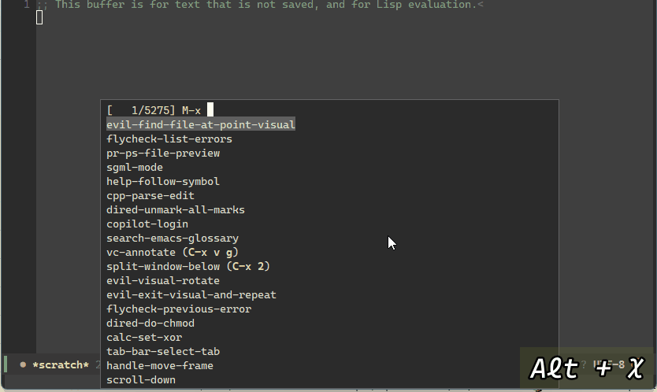

Code search integration for `Emacs`
=================================

`research.el` is an `Emacs` plugin that can be used for code searching in `Azure DevOps` and `GitHub` repositories.
Support for integration with other forges is currently under development.



### News
- 12/23/2021: Add support for `GitHub` code search

# How to install
Via [`Quelpa`](https://github.com/quelpa/quelpa)

``` emacs-lisp
(quelpa '(ghub :fetcher github :repo "kiennq/ghub"))
(quelpa '(research :fetcher git
                   :url "git@github.com:kiennq/emacs-research-mode.git"))
```

## Using personal access token (PAT)
You can use personal access tokens (PATs) to query the code search results.
After obtaining your PATs, you can save them into the `~/.authinfo` file (or `~/.authinfo.gpg` as an encrypted file).
The username should be set to:
- `azdev^token` for `Azure DevOps`
- `<account>^token` for other services

For example:

``` conf
machine almsearch.dev.azure.com/<org> login azdev^token password <PAT>
machine dev.azure.com/<org> login azdev^token password <PAT>
machine api.github.com login <account>^token password <PAT>
```

Afterward, you can start exploring this plugin.

## Using cookie
If you prefer not to set up PATs, an alternative method is to authenticate via a browser and then transfer the cookie to Emacs.

``` emacs-lisp
(setq research-default-auth-method 'cookie)
```

The cookie from browswer can be obtained by using [Cookie-Editor](https://cookie-editor.com/).

# Sample setup

``` emacs-lisp
(use-package research
  :quelpa (research
           :fetcher git
           :url "git@github.com:kiennq/emacs-research-mode.git")
  :defer t
  :diminish
  :init
  (with-eval-after-load 'evil
    (evil-define-key 'normal 'umbrella-keybind-mode
      (kbd "SPC s r") #'research-query
      (kbd "SPC s e") #'research-add-repo
      (kbd "SPC s d") #'research-query-def
      (kbd "SPC s S") #'research-set-default-scope
      (kbd "SPC s c") #'research-set-collection)
    (evil-define-key 'normal 'research-mode
      (kbd "SPC s n") #'research-next-in-buffer
      (kbd "SPC s w") #'research-open-buffer-url
      (kbd "SPC s f") #'research-browse-folder))
  :config
  (research-mode +1))
```

# For development
`research.el` includes several extension functions that can be utilized to add support for other forges.

``` emacs-lisp
(cl-defgeneric research--refresh-auth (_host _auth _forge)
  "Try to re-authenticate for HOST with AUTH method of FORGE."
  nil)

(cl-defgeneric research--get-collections ((repo-rcp research--rcp))
  "Get collections of REPO-RCP.")

(cl-defgeneric research--add-repo (type)
  "Add a repository of type TYPE into search collections.")

(cl-defgeneric research--query ((repo research--repo) query page max-result)
  "Query QUERY to repository REPO with page PAGE.
Return at most MAX-RESULT items.")

(cl-defgeneric research--buf-pos (pos)
  "Calculate the position in current buffer from POS.")

(cl-defgeneric research--load-file ((file research--code-result))
  "Load the remote FILE.")

;; utilities.
(cl-defgeneric research--buffer-position-url (code-result line)
  "Return the current buffer file url with LINE information included.")
```

It also features several structs that can be employed to store the returned data from these functions.

``` emacs-lisp
(cl-defstruct research--rcp
  "Recipe for the repository."
  (id)
  (org)
  (repo))

(cl-defstruct research--repo
  "Base type for the repository that we search on."
  (name nil :documentation "Display name." :read-only t)
  ;; rcp can contain empty data, dont rely on it
  (rcp nil :read-only t)
  (root nil :documentation "Alist map from path prefixes to storage paths.")
  (skip-calc-pos t))

(cl-defstruct research--code-result
  "The code result"
  (path nil :documentation "Path to current result.")
  (url nil :documentation "URL to the current result.")
  (id nil :documentation "Version id.")
  (org)
  (repo)
  (repo-metadata)
  (matches nil :type list :documentation "List of offsets"))
```

When adding support for a new forge, you should create a new type that inherits from the listed base types and then implement the generic functions accordingly.
